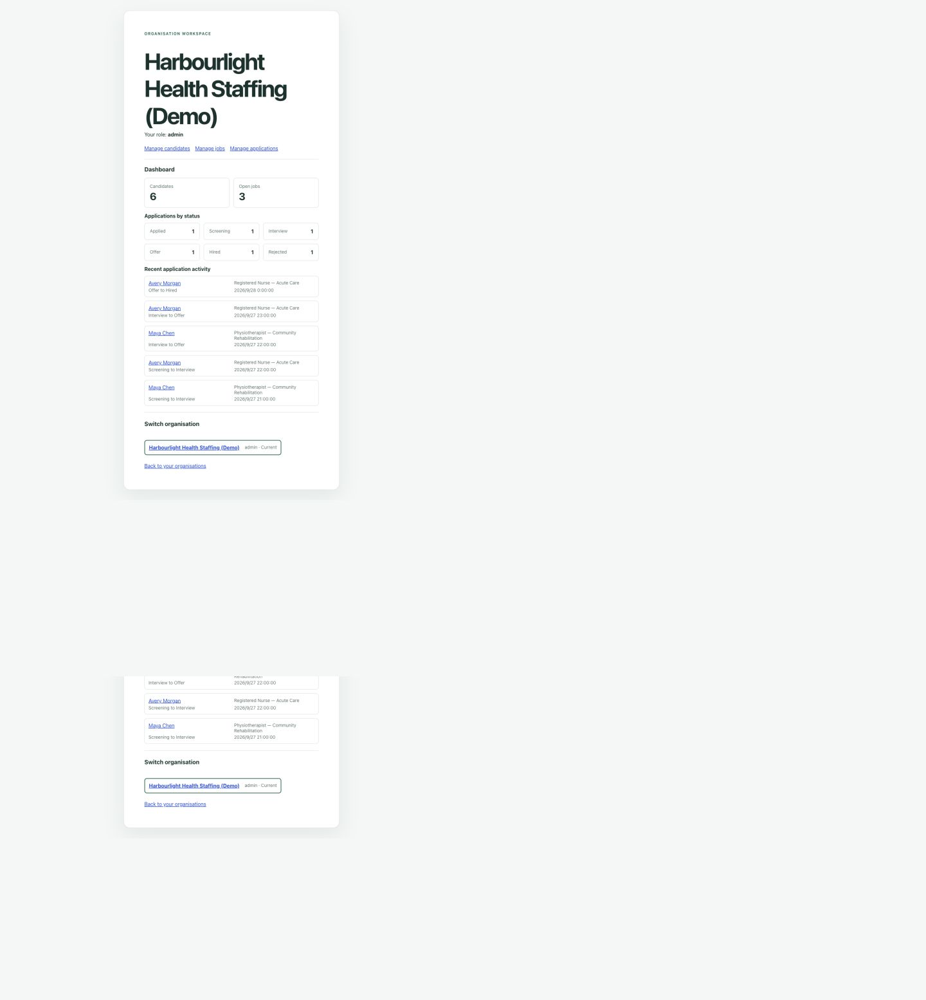
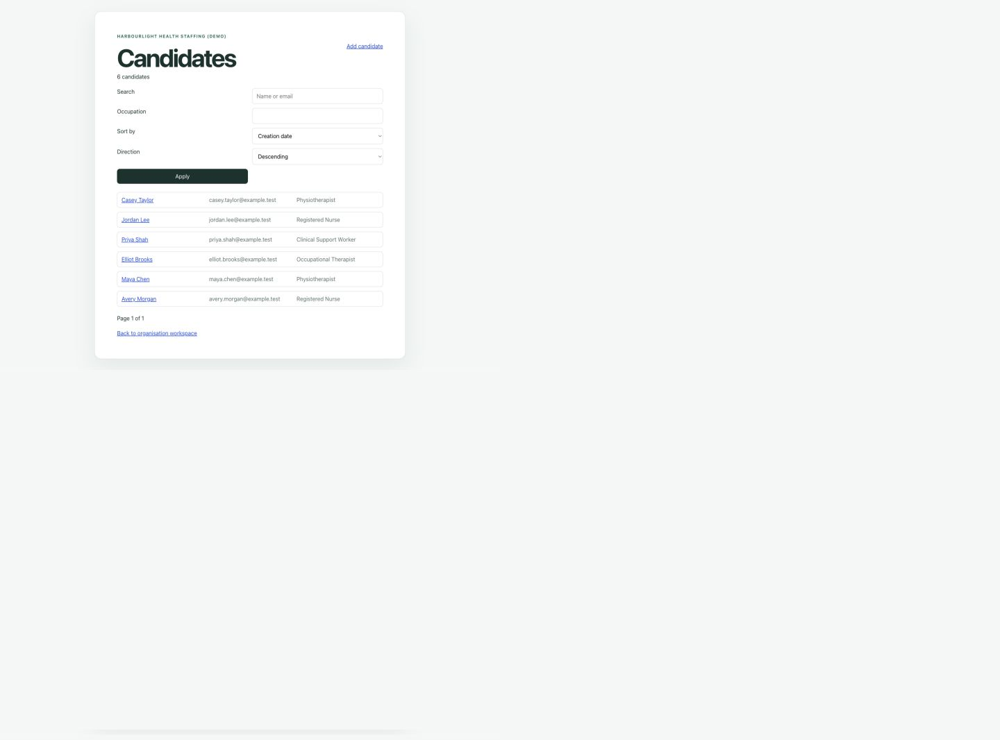
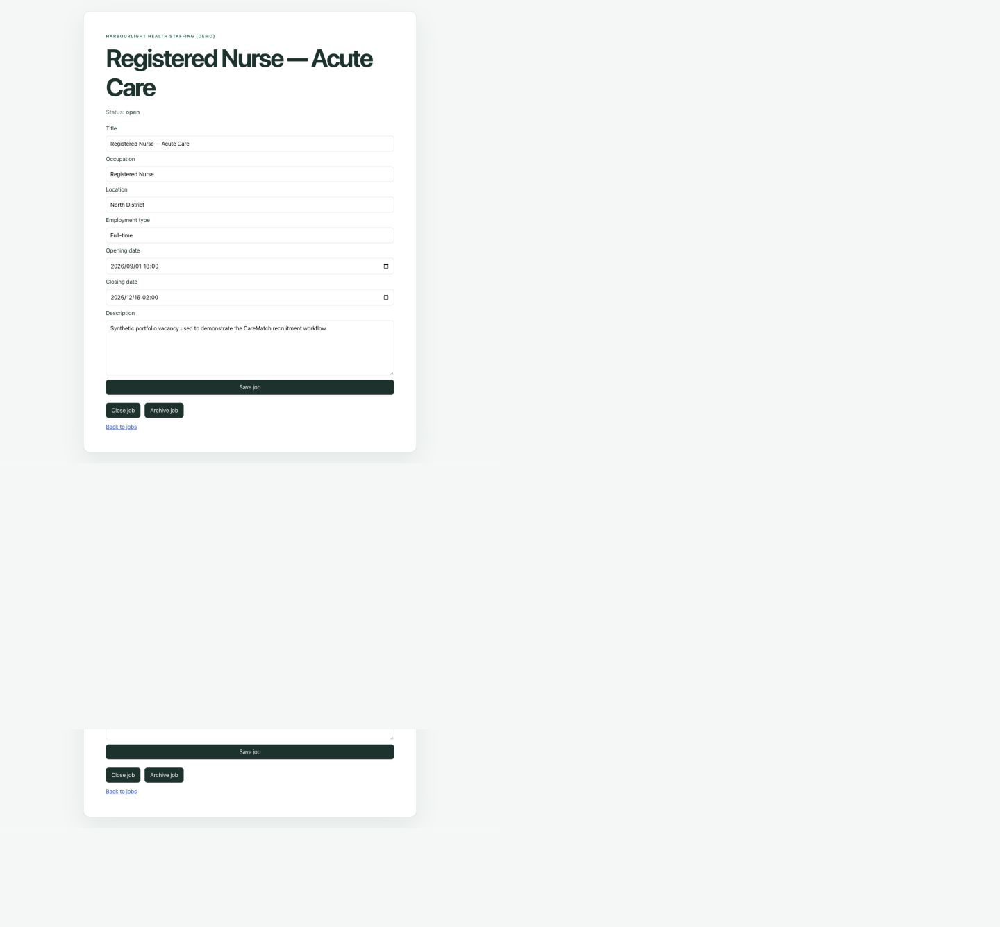
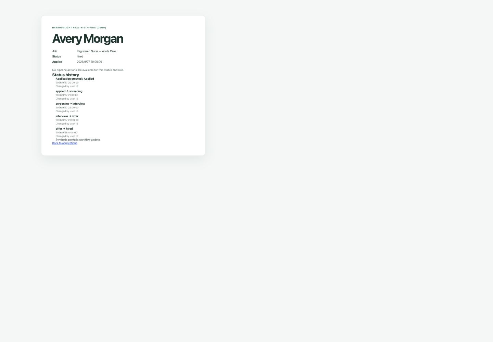

# CareMatch

[](https://github.com/Toyody/carematch/actions/workflows/ci.yml)

CareMatch is a portfolio-ready, multi-tenant healthcare recruitment SaaS. It demonstrates tenant-safe candidate management, job requisitions, recruitment pipelines, private candidate documents, deterministic explainable matching, role-based access control, an append-only business audit trail, an operational dashboard, and cohort-based recruitment analytics in a modular Laravel and Next.js application.



## What this project demonstrates

- A modular monolith organised by business module, with pragmatic Clean Architecture boundaries.
- Strict organisation isolation enforced through route-derived tenant context, active membership checks, policies, scoped queries, and database constraints.
- Stateful first-party SPA authentication with Laravel Sanctum, database sessions, CSRF protection, and abuse-sensitive rate limits.
- Recruitment workflows with guarded status transitions, immutable history, and concurrency protection.
- Private candidate-document storage and authorised download endpoints.
- A typed Next.js client, accessible responsive UI, OpenAPI contract, and layered automated tests including a critical Playwright flow.
- A real SQS-backed Compliance digest worker, Redis coordination, DLQ integration tests, and repository-side Terraform/CloudWatch definitions.

## Core features

- Global user registration, login, logout, password reset, and current-session discovery.
- Organisations with Admin, Recruiter, and Hiring Manager membership roles.
- Invitation and membership lifecycle management.
- Tenant-scoped candidate records and private document handling.
- Job creation and lifecycle management.
- Applications with pipeline transitions and auditable status history.
- Explainable Job-to-Candidate ranking using qualification coverage, exact occupation compatibility and PostGIS distance.
- An Admin-only, tenant-scoped audit trail for meaningful business mutations.
- An organisation dashboard with status breakdowns and recent activity.
- UTC date-range recruitment analytics with reached-stage funnels, current cohort status, daily volume, median time-to-stage and bounded Job aggregates.
- Admin-requested asynchronous credential-expiry digests containing aggregate counts only.

## Portfolio screens

| Candidate management | Job lifecycle detail |
| --- | --- |
|  |  |



All displayed names, email addresses, organisations, locations, notes, and job descriptions are synthetic portfolio data.

## Architecture

The backend is a Laravel modular monolith. Business code is organised module-first (`Identity`, `Organisation`, `Candidate`, `Recruitment`, `Compliance`, `Matching`, `Audit`, `Dashboard`, and `Analytics`) and then by `Domain`, `Application`, `Infrastructure`, and `Interfaces` where those layers provide concrete value. The Next.js frontend communicates with the REST API through a small typed fetch client.

```text
Browser / Next.js SPA
        │  stateful cookies + CSRF
        ▼
Laravel REST API
  ├── Identity
  ├── Organisation
  ├── Candidate
  ├── Recruitment
  ├── Compliance
  ├── Matching
  ├── Audit
  ├── Dashboard
  └── Analytics
        │
        ├── PostgreSQL 18 + PostGIS 3.6
        ├── Redis cache, rate limits and distributed locks
        ├── SQS → Laravel worker → DLQ
        └── Private document storage
```

See the [architecture overview](docs/diagrams/architecture.md), [entity-relationship diagram](docs/diagrams/entity-relationship.md), [architecture decisions](docs/architecture.md), and [production deployment runbook](docs/deployment.md) for more detail.

### Tenant isolation

Tenant-owned routes resolve the organisation from the URL. Laravel authenticates the user before tenant resolution, and the resolver verifies an active persisted membership before providing a request-scoped tenant context. Controllers and application use cases receive trusted tenant and user identifiers; request bodies cannot select ownership, users, or roles. Composite PostgreSQL constraints protect critical cross-tenant relationships.

### Concurrency and data integrity

- Organisation creation and its initial Admin membership are committed atomically.
- Invitation acceptance locks and consumes the invitation together with membership activation.
- Application creation locks the tenant-scoped Job, verifies its persisted state is Open, and creates the Application plus initial history atomically.
- Application transitions lock the tenant-scoped Application with `FOR UPDATE`, authorise against its persisted state, apply the Domain transition, and append immutable history in one transaction.
- Uniqueness, check, foreign-key, and composite constraints remain the final integrity boundary.

### Sensitive documents

Candidate documents use cryptographically random storage keys on a private disk. Uploads accept only server-detected PDF/DOCX files up to 10 MiB. Upload metadata and storage writes are coordinated so failed operations do not leave authorised database records pointing at missing files. Downloads pass through authentication, tenant membership, policy checks, and tenant-scoped lookup; storage URLs are never exposed directly. Admins and Recruiters may write, while Hiring Managers have read-only access. Production use with real candidate documents still requires a real malware-scanning strategy; CareMatch does not simulate or claim one.

### Dashboard query design

The dashboard uses fixed aggregate and recent-activity queries instead of loading entire collections. Recent application activity is eagerly loaded with the candidate and job data required by the response, avoiding an N+1 query pattern. A representative development `EXPLAIN ANALYZE` improved the measured recent-activity query from about 35.5 ms to 0.09 ms after one query-shaped index was added; this is evidence from local test data, not a production SLA.

### Deterministic matching

The Job matching page ranks only Candidates from the resolved Organisation. It uses a documented lexicographic order: qualification coverage, trimmed case-insensitive exact occupation compatibility, known PostGIS distance in kilometres, then Candidate ID. It exposes each factor instead of an opaque score, treats missing distance as unavailable rather than zero, and never uses notes, availability, document contents, personal identifiers, free-text descriptions, AI or external geocoding. Matching is read-only decision support; human users remain responsible for recruitment decisions.

### Recruitment analytics

Analytics is separate from the lightweight Dashboard. It reports on Applications submitted in an explicit UTC period, then uses their authoritative status history to show reached-stage funnel counts, separate rejection outcomes, current cohort status, daily Application volume, median time to Interview/Hired with sample sizes, and the ten busiest referenced Jobs. It returns no Candidate identities and does not use audit metadata, free text, matching results, employee-performance metrics, demographic inference, prediction or AI. Reports are derived synchronously from PostgreSQL and are not persisted.

## Technology

- PHP 8.5, Laravel 13, Laravel Sanctum
- PostgreSQL 18 with PostGIS 3.6
- Node.js 24, Next.js 16, React 19, TypeScript
- Docker Compose
- PHPUnit, PHPStan level 8, Laravel Pint
- Vitest, Testing Library, ESLint, Prettier
- Playwright for the critical recruitment browser flow
- Redis 8.2, Amazon SQS, Laravel queue workers, Terraform 1.14 and k6 2.3
- OpenAPI 3.1 with Redocly linting

## Testing and quality checks

Run the complete local validation suite:

```bash
make check
```

Run the isolated browser flow:

```bash
make test-e2e
```

Validate the production images and local same-origin routing:

```bash
make test-production-images
```

Run the disposable real Redis/SQS-compatible worker integration, repository-side
Terraform validation, and short synthetic performance smoke separately:

```bash
make test-async
make test-terraform
make test-performance
```

`make test-performance` uses three virtual users for ten seconds against health,
Dashboard, Analytics and Matching. Its broad error/check thresholds catch severe
regressions; laptop or CI timings are not a production SLA.

The checks cover backend and frontend tests, static analysis, linting and formatting, dependency audits, production frontend build, OpenAPI linting, PostgreSQL-backed constraints, tenant-isolation scenarios, and the critical end-to-end flow.

## Synthetic local demo

The portfolio seeder is deliberately opt-in. It refuses to run in production, requires an explicit password from the environment, accepts only a reserved `example.test` email address, and creates no candidate-document files.

```bash
CARE_MATCH_DEMO_PASSWORD='choose-a-local-password-of-12-plus-characters' make demo-seed
```

The default account is `demo.admin@example.test`. You can override it with `CARE_MATCH_DEMO_EMAIL`, provided it remains under `example.test`. Running the command again reuses the same deterministic demo records rather than duplicating them.

The seeded organisation contains realistic but fictional candidates, jobs, locality-level matching coordinates, varied qualification coverage, one application in each pipeline status, and coherent transition histories. Never use real personal information in demo data.

Phase 6A adds a separate, explicitly guarded production public-demo provisioning command. It requires public-demo mode, an `@example.test` identity, a deployment-injected password and an operator confirmation flag. It does not run at startup, truncate data or provide an automated destructive reset. See the deployment runbook for the exact procedure.

## Local development

Requirements: Docker with Compose support and GNU Make.

```bash
cp backend/.env.example backend/.env
cp frontend/.env.example frontend/.env.local
make setup
make up
```

Open:

- Frontend: [http://localhost:3000](http://localhost:3000)
- Backend health endpoint: [http://localhost:8000/api/v1/health](http://localhost:8000/api/v1/health)

Useful commands:

```bash
make up          # Start the local stack
make down        # Stop it
make test        # Backend and frontend tests
make check       # Full validation suite
make test-e2e    # Isolated Playwright stack and critical flow
make test-async  # Redis + SQS producer/worker/retry/DLQ integration
make test-terraform # Terraform fmt/init-without-backend/validate
make test-performance # Disposable synthetic k6 smoke
make demo-seed   # Seed deterministic synthetic portfolio data
```

## API and project documentation

- [OpenAPI contract](openapi/openapi.yaml)
- [Product requirements](docs/product-requirements.md)
- [Architecture](docs/architecture.md)
- [Database design](docs/database-design.md)
- [Roadmap](docs/roadmap.md)
- [Production deployment runbook](docs/deployment.md)

## Repository structure

```text
backend/            Laravel modular monolith and PHPUnit suite
frontend/           Next.js SPA and Vitest suite
e2e/                Playwright critical recruitment flow
openapi/            OpenAPI 3.1 contract and lint configuration
docs/               Product, architecture, database, diagrams, and screenshots
compose.yaml        Local application stack
compose.e2e.yaml    Isolated browser-test stack
compose.async.yaml  Optional Redis/SQS worker integration overlay
infra/terraform/    Unapplied production-target AWS definitions
performance/        Synthetic k6 smoke workload
```

## Current status

The local and CI-tested portfolio scope through Phase 8 is implemented. Phase 8
means repository-side readiness: no Terraform was applied and no live AWS
resources or CloudWatch alarms were verified. HTTPS/domain configuration, live
managed infrastructure, deployed secrets, RDS/PostGIS compatibility, alarm
delivery, and backup/restore drills remain Phase 6B/6C work. Phase 9 remains
unimplemented.
