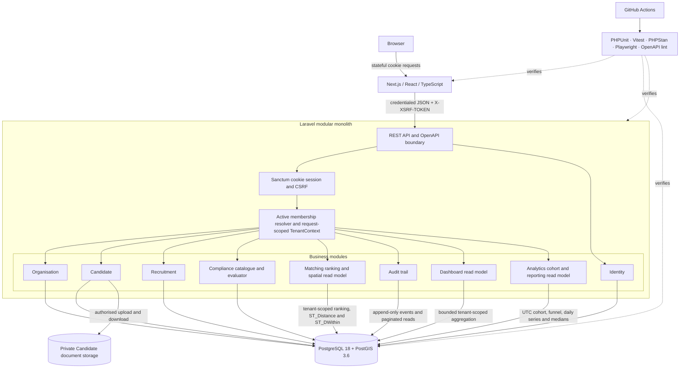

# CareMatch Architecture Overview

This diagram shows the currently implemented local and CI architecture. Public
HTTPS hosting and AWS infrastructure remain Phase 6 work.

## Key decisions

- The backend is one deployable modular monolith. Modules are organised first by
  business capability and then by pragmatic Clean Architecture layers.
- The Organisation route identifier is not trusted by itself. Authentication,
  active persisted membership resolution and the request-scoped `TenantContext`
  precede tenant-owned use cases.
- Candidate, Job, Application and document queries use the trusted Organisation
  identifier. PostgreSQL composite foreign keys independently reject important
  cross-tenant relationships.
- Recruitment state changes are domain-validated and transactionally locked.
  Application status updates append immutable history in the same transaction.
- Candidate document bytes live on a private Laravel disk. The API exposes only
  authorised downloads and never returns the random internal storage key.
- Dashboard is a read-only cross-module projection. It owns no Candidate or
  Recruitment records and uses four fixed tenant-scoped queries.
- Analytics is a separate read-only projection over authoritative Candidate,
  Application, Job and status-history records. It uses four fixed tenant-scoped
  PostgreSQL queries and persists no report or aggregate cache.
- Compliance owns the shared qualification catalogue and deterministic temporal
  evaluator. Candidate credentials remain in Candidate and Job requirements in
  Recruitment; tenant-safe Infrastructure read models provide bounded inputs to
  the framework-independent evaluator.
- Audit owns semantic tenant business events and an Admin-only read model.
  Business mutations and their audit insert commit together without observers
  or a generic event bus.
- Matching owns no persisted business records. Its two-query PostGIS projection
  ranks tenant Candidates by qualification, exact occupation, distance and a
  stable ID tie-breaker, and returns machine-readable factors for human review.

See [the detailed architecture](../architecture.md) and
[the entity-relationship diagram](entity-relationship.md).
