# CareMatch Entity-Relationship Diagram

This diagram is derived from the current Laravel migrations. It focuses on the
tables and relationships relevant to the implemented portfolio feature set.

```mermaid
erDiagram
    USERS {
        bigint id PK
        string name
        string email UK
        timestamp email_verified_at
        string password
        string remember_token
        timestamp created_at
        timestamp updated_at
    }
    SESSIONS {
        string id PK
        bigint user_id
        string ip_address
        text user_agent
        text payload
        integer last_activity
    }
    PASSWORD_RESET_TOKENS {
        string email PK
        string token
        timestamp created_at
    }
    PERSONAL_ACCESS_TOKENS {
        bigint id PK
        string tokenable_type
        bigint tokenable_id
        string token UK
        timestamp expires_at
    }
    ORGANISATIONS {
        bigint id PK
        string name
        timestamp created_at
        timestamp updated_at
    }
    ORGANISATION_MEMBERSHIPS {
        bigint id PK
        bigint organisation_id FK
        bigint user_id FK
        string role
        timestamp deactivated_at
    }
    ORGANISATION_INVITATIONS {
        bigint id PK
        bigint organisation_id FK
        string email
        string role
        string token_hash UK
        bigint invited_by_user_id FK
        timestamp expires_at
        timestamp accepted_at
        timestamp revoked_at
    }
    CANDIDATES {
        bigint id PK
        bigint organisation_id FK
        string first_name
        string last_name
        string email
        string occupation
        string location
        decimal latitude
        decimal longitude
        geography location_geography
        string availability
    }
    CANDIDATE_DOCUMENTS {
        bigint id PK
        bigint organisation_id FK
        bigint candidate_id FK
        string original_name
        string storage_key UK
        string mime_type
        bigint size_bytes
        bigint uploaded_by_user_id FK
    }
    JOBS {
        bigint id PK
        bigint organisation_id FK
        string title
        string occupation
        string location
        decimal latitude
        decimal longitude
        geography location_geography
        string employment_type
        string status
        timestamp opened_at
        timestamp closes_at
    }
    APPLICATIONS {
        bigint id PK
        bigint organisation_id FK
        bigint job_id FK
        bigint candidate_id FK
        string status
        timestamp applied_at
        bigint created_by_user_id FK
    }
    APPLICATION_STATUS_HISTORY {
        bigint id PK
        bigint organisation_id FK
        bigint application_id FK
        string from_status
        string to_status
        bigint changed_by_user_id FK
        text note
        timestamp created_at
    }
    QUALIFICATION_DEFINITIONS {
        bigint id PK
        bigint organisation_id FK
        string name
        string category
        boolean is_active
    }
    CANDIDATE_QUALIFICATIONS {
        bigint id PK
        bigint organisation_id FK
        bigint candidate_id FK
        bigint qualification_definition_id FK
        string issuer
        string credential_number
        date issued_on
        date expires_on
    }
    JOB_QUALIFICATION_REQUIREMENTS {
        bigint id PK
        bigint organisation_id FK
        bigint job_id FK
        bigint qualification_definition_id FK
    }
    AUDIT_EVENTS {
        bigint id PK
        bigint organisation_id FK
        bigint actor_user_id FK
        string event_type
        string subject_type
        bigint subject_id
        jsonb metadata
        timestamptz occurred_at
    }
    COMPLIANCE_EXPIRY_DIGEST_REQUESTS {
        bigint id PK
        bigint organisation_id FK
        bigint requested_by_user_id FK
        string idempotency_key_hash UK
        string request_fingerprint
        string status
        integer expired_count
        integer expiring_count
        string failure_code
        timestamptz queued_at
        timestamptz sent_at
        timestamptz failed_at
    }
    AI_CV_EXTRACTIONS {
        bigint id PK
        bigint organisation_id FK
        bigint candidate_id FK
        bigint candidate_document_id
        bigint requested_by_user_id FK
        string idempotency_key_hash UK
        string status
        jsonb draft
        string candidate_fingerprint
    }
    AI_MATCH_EXPLANATIONS {
        bigint id PK
        bigint organisation_id FK
        bigint job_id FK
        bigint candidate_id FK
        bigint requested_by_user_id FK
        string source_fingerprint UK
        string status
        string summary
        jsonb factors
    }

    USERS ||--o{ ORGANISATION_MEMBERSHIPS : has
    ORGANISATIONS ||--o{ ORGANISATION_MEMBERSHIPS : contains
    ORGANISATIONS ||--o{ ORGANISATION_INVITATIONS : issues
    ORGANISATION_MEMBERSHIPS ||--o{ ORGANISATION_INVITATIONS : invites
    ORGANISATIONS ||--o{ CANDIDATES : owns
    ORGANISATIONS ||--o{ JOBS : owns
    ORGANISATIONS ||--o{ APPLICATIONS : owns
    ORGANISATIONS ||--o{ CANDIDATE_DOCUMENTS : owns
    CANDIDATES ||--o{ APPLICATIONS : submits
    JOBS ||--o{ APPLICATIONS : receives
    CANDIDATES ||--o{ CANDIDATE_DOCUMENTS : has
    ORGANISATION_MEMBERSHIPS ||--o{ CANDIDATE_DOCUMENTS : uploads
    ORGANISATION_MEMBERSHIPS ||--o{ APPLICATIONS : creates
    APPLICATIONS ||--|{ APPLICATION_STATUS_HISTORY : records
    ORGANISATION_MEMBERSHIPS ||--o{ APPLICATION_STATUS_HISTORY : changes
    ORGANISATIONS ||--o{ QUALIFICATION_DEFINITIONS : defines
    CANDIDATES ||--o{ CANDIDATE_QUALIFICATIONS : holds
    QUALIFICATION_DEFINITIONS ||--o{ CANDIDATE_QUALIFICATIONS : classifies
    JOBS ||--o{ JOB_QUALIFICATION_REQUIREMENTS : requires
    QUALIFICATION_DEFINITIONS ||--o{ JOB_QUALIFICATION_REQUIREMENTS : specifies
    ORGANISATIONS ||--o{ AUDIT_EVENTS : owns
    ORGANISATION_MEMBERSHIPS ||--o{ AUDIT_EVENTS : acts
    ORGANISATIONS ||--o{ COMPLIANCE_EXPIRY_DIGEST_REQUESTS : owns
    USERS ||--o{ COMPLIANCE_EXPIRY_DIGEST_REQUESTS : requests
    ORGANISATIONS ||--o{ AI_CV_EXTRACTIONS : owns
    CANDIDATES ||--o{ AI_CV_EXTRACTIONS : receives_draft
    ORGANISATIONS ||--o{ AI_MATCH_EXPLANATIONS : owns
    JOBS ||--o{ AI_MATCH_EXPLANATIONS : explains
    CANDIDATES ||--o{ AI_MATCH_EXPLANATIONS : explains
```

## Integrity notes

- `organisation_memberships` is unique by `(organisation_id, user_id)` and
  preserves historical actor identity through logical deactivation.
- A partial unique index permits only one unresolved Organisation invitation per
  `(organisation_id, email)`; `accepted_at` and `revoked_at` record its terminal
  lifecycle state.
- Applications use composite foreign keys from `(organisation_id, job_id)` and
  `(organisation_id, candidate_id)`. The creator is also referenced through
  `(organisation_id, created_by_user_id)`, so cross-tenant links fail in
  PostgreSQL even if application validation is bypassed. The Candidate/Job pair
  is unique within its Organisation.
- Candidate documents apply the same pattern to their Candidate and uploader.
  Status history applies it to both its Application and actor.
- An Organisation/Candidate/Job/Application ID in a URL is still scoped by the
  resolved `TenantContext`; database constraints are defence in depth rather
  than the only tenant control.
- `sessions.user_id` is deliberately nullable and indexed without a foreign key.
  `password_reset_tokens.email` follows Laravel Password Broker's schema.
- Sanctum's `personal_access_tokens` table is installed, but CareMatch does not
  expose personal-access-token product functionality.
- PostgreSQL check constraints restrict membership roles, Job states,
  Application states, invitation state combinations and positive document size.
- Audit events use a tenant/actor composite foreign key, object-shaped JSONB
  metadata and a PostgreSQL trigger that rejects UPDATE and DELETE.
- Qualification credentials and Job requirements use composite tenant foreign
  keys. Candidate renewals are allowed, while duplicate Job requirements are
  rejected. Issue/expiry dates use `DATE`, with a CHECK for chronological order;
  time-dependent expiry classification remains application logic.
- Candidate and Job latitude/longitude pairs are range-checked and drive stored
  generated PostGIS geography points in SRID 4326. Candidate geography has a
  GiST index for radius matching; derived match rankings are not persisted.
- Expiry digest requests uniquely scope the hashed client idempotency key to
  Organisation and requester. Status/count/timestamp CHECK constraints protect
  the small lifecycle; queue payloads contain only this table's internal ID.
- CV extraction requests uniquely scope the hashed Idempotency-Key to tenant and
  requester; composite Candidate/membership FKs protect ownership. The immutable
  source-document ID intentionally survives source deletion without being
  reattached to another document. Match explanations are unique by tenant,
  Job, Candidate and exact deterministic source fingerprint. Neither table
  stores raw CV text, provider payloads or an AI score.

See [database design](../database-design.md) for exact constraints, indexes and
transaction behaviour.
